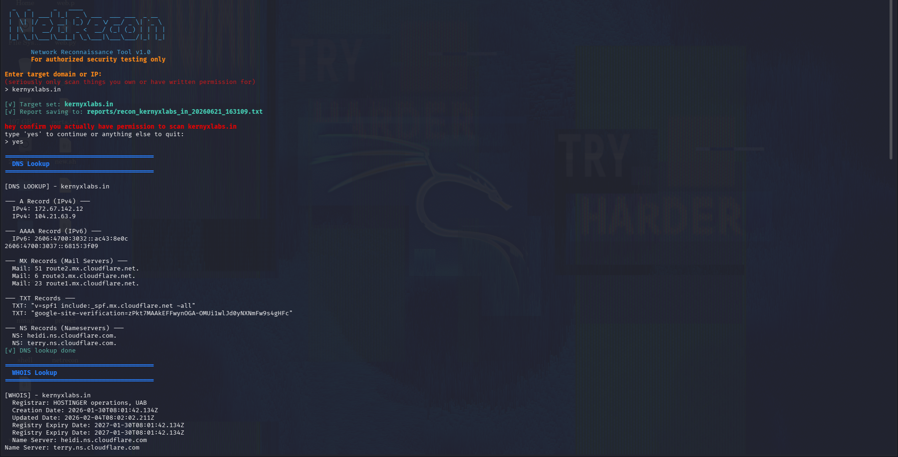
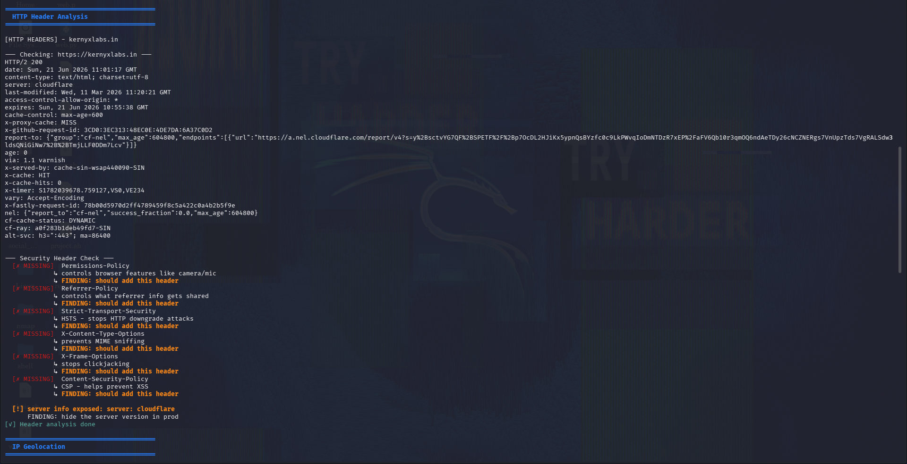
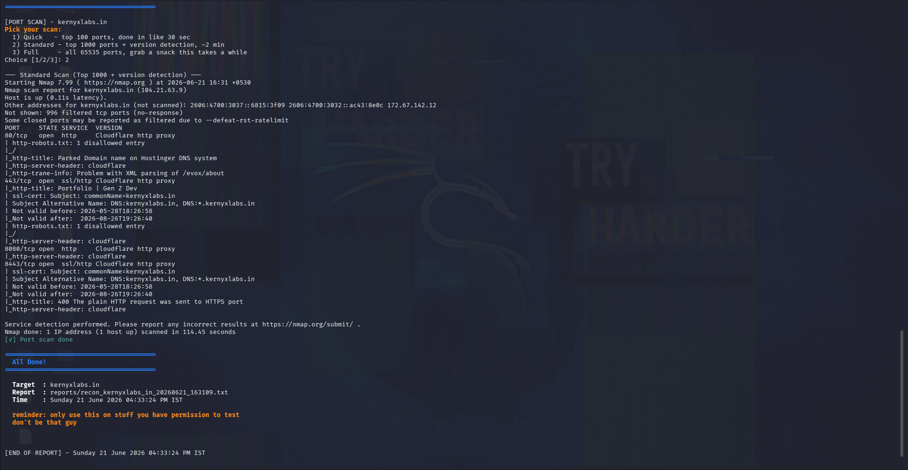

# NetReconn 🔍

a tool i made that does network recon. you give it a domain or ip and it collects a bunch of info about it like dns records, open ports, subdomains and more. everything gets saved in a report file at the end.

i built this to learn how recon actually works in practice. its still being worked on but it does the job.

> ⚠️ please only use this on systems you own or have permission to test. unauthorized scanning is illegal.

---

## what it does

- 🔎 **DNS Lookup** — finds all the dns records of the target
- 📋 **WHOIS** — shows who owns the domain, when it was registered, when it expires
- 🔌 **Port Scan** — scans ports using nmap, you can choose between 3 modes
- 🛡️ **HTTP Header Check** — checks if the website is missing important security headers
- 🌍 **IP Geolocation** — shows where the server is, which isp, city, country etc
- 🕵️ **Subdomain Finder** — finds subdomains passively using crt.sh, never touches the target directly
- 📁 **Auto Report** — saves all the results in a timestamped file so you dont lose anything

---

## Screenshots

**startup screen & dns lookup results**



**http header check**



**Ports Report**




---

## Requirements

- Linux (tested on Kali and Ubuntu, should work on Fedora and Arch too)
- Bash
- `curl`, `whois`, `dig`, `nmap` — install.sh takes care of all of this

---

## Installation

```bash
git clone https://github.com/AsyncAshish/NetReconn.git
cd NetReconn
chmod +x install.sh NetRecon.sh
bash install.sh
```

install.sh will detect your package manager and install everything it needs. it removes itself after running so your folder stays clean.

---

## How to use

just run it:

```bash
./NetRecon.sh
```

or pass the target directly:

```bash
./NetRecon.sh example.com
```

it will ask you to confirm you have permission before doing anything. type `yes` to continue.

for the port scan you get three options:

| option | description | time |
|--------|-------------|------|
| `1` | Quick — scans top 100 ports | around 30 seconds |
| `2` | Standard — top 1000 ports with version detection | around 2 minutes |
| `3` | Full — all 65535 ports with OS detection | takes a while |

reports are saved to the `reports/` folder with the target name and timestamp in the filename.

---

## folder structure

```
NetReconn/
├── NetRecon.sh       # the main script
├── install.sh        # installs dependencies
└── reports/          # scan reports get saved here
```

---

## things i want to add

- [ ] WAF detection
- [ ] SPF / DKIM / DMARC record checks
- [ ] Shodan API support
- [ ] a quiet mode that only saves the report without printing everything

---

## disclaimer

this tool is made for learning and authorized security testing only. please do not scan systems you dont own or have permission to test. that is illegal and not what this tool is for.

---

made by [AsyncAshish](https://github.com/AsyncAshish) — still working on it, feel free to open an issue if you find a bug or have a suggestion
